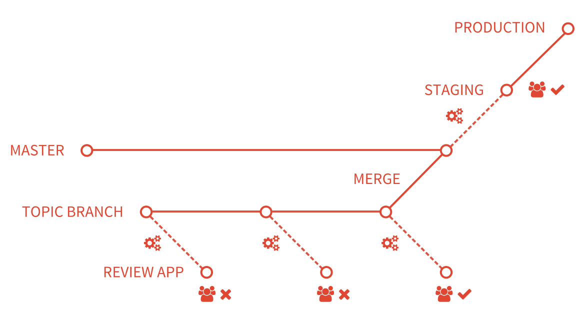

# Review Apps

> - [Introduced](https://gitlab.com/gitlab-org/gitlab-ce/issues/21971) in GitLab 8.12. Further additions were made in GitLab 8.13 and 8.14.
> - Inspired by [Heroku's Review Apps](https://devcenter.heroku.com/articles/github-integration-review-apps), which itself was inspired by [Fourchette](https://github.com/rainforestapp/fourchette).

For a video introduction to Review Apps, see [8.14 Webcast: Review Apps & Time Tracking Beta (EE) - GitLab Release](https://www.youtube.com/watch?v=CteZol_7pxo).

## Overview

Review Apps are a collaboration tool that takes the hard work out of providing an environment to showcase product changes.

Review Apps:

- Provide an automatic live preview of changes made in a feature branch by spinning up a dynamic environment for your merge requests.
- Allow designers and product manages to see your changes without needing to check out your branch and run your changes in a sandbox environment.
- Are fully integrated with the [GitLab DevOps LifeCycle](../../README.md#complete-devops-with-gitlab).
- Allow you to deploy your changes wherever you want.

Reviewing anything, from performance to interface changes, becomes much easier with a live environment and so Review Apps can make a large impact on your development flow.

## What are Review Apps?

A Review App is a mapping of a branch with an [environment](../environments.md). The following is an example of a merge request with an environment set dynamically.

In this example, you can see a branch was:

- Successfully built.
- Deployed under a dynamic environment that can be reached by clicking on the **View app** button.

## How do Review Apps work?

The basis of Review Apps in GitLab is [dynamic environments](../environments.md#dynamic-environments), which allow you to dynamically create a new environment for each branch.

Access to the Review App is made available as a link on the [merge request](../../user/project/merge_requests.md) relevant to the branch. Review Apps enable you to review all changes proposed by the merge request in live environment.

## Use cases

Some supported use cases include the:

- Simple case of deploying a simple static HTML website.
- More complicated case of an application that uses a database. Deploying a branch on a temporary instance and booting up this instance with all required software and services automatically on the fly is not a trivial task. However, it is possible, especially if you use Docker or a configuration management tool like Chef, Puppet, Ansible, or Salt.

Review Apps usually make sense with web applications, but you can use them any way you'd like.

## Implementing Review Apps

Implementing Review Apps depends on your:

- Technology stack.
- Deployment process.

### Prerequisite Knowledge

To get a better understanding of Review Apps, review documentation on how environments and deployments work. Before you implement your own Review Apps:

1. Learn about [environments](../environments.md) and their role in the development workflow.
1. Learn about [CI variables](../variables/README.md) and how they can be used in your CI jobs.
1. Explore the [`environment` syntax](../yaml/README.md#environment) as defined in `.gitlab-ci.yml`. This will become a primary reference.
1. Additionally, find out about [manual actions](../environments.md#manual-actions) and how you can use them to deploy to critical environments like production with the push of a button.
1. Follow the [example tutorials](#examples). These will guide you through setting up infrastructure and using Review Apps.

### Configuring dynamic environments

Configuring Review Apps dynamic environments depends on your technology stack and infrastructure.

For more information, see [dynamic environments](../environments.md#dynamic-environments) documentation to understand how to define and create them.

### Creating and destroying Review Apps

Creating and destroying Review Apps is defined in `.gitlab-ci.yml` at a job level under the `environment` keyword.

For more information, see [Introduction to environments and deployments](../environments.md).

### Adding Review Apps to your workflow

The process of adding Review Apps in your workflow is as follows:

1. Set up the infrastructure to host and deploy the Review Apps.
1. [Install](https://docs.gitlab.com/runner/install/) and [configure](https://docs.gitlab.com/runner/commands/) a Runner to do deployment.
1. Set up a job in `.gitlab-ci.yml` that uses the predefined [predefined CI environment variable](../variables/README.md) `${CI_COMMIT_REF_NAME}` to create dynamic environments and restrict it to run only on branches.
1. Optionally, set a job that [manually stops](../environments.md#stopping-an-environment) the Review Apps.

After adding Review Apps to your workflow, you follow the branched Git flow. That is:

1. Push a branch and let the Runner deploy the Review App based on the `script` definition of the dynamic environment job.
1. Wait for the Runner to build and deploy your web application.
1. Click on the link that provided in the merge request related to the branch to see the changes live.

## Limitations

Check the [environments limitations](../environments.md#limitations).

## Examples

The following are example projects that use Review Apps with:

- [NGINX](https://gitlab.com/gitlab-examples/review-apps-nginx).
- [OpenShift](https://gitlab.com/gitlab-examples/review-apps-openshift).

See also the video [Demo: Cloud Native Development with GitLab](https://www.youtube.com/watch?v=jfIyQEwrocw), which includes a Review Apps example.
