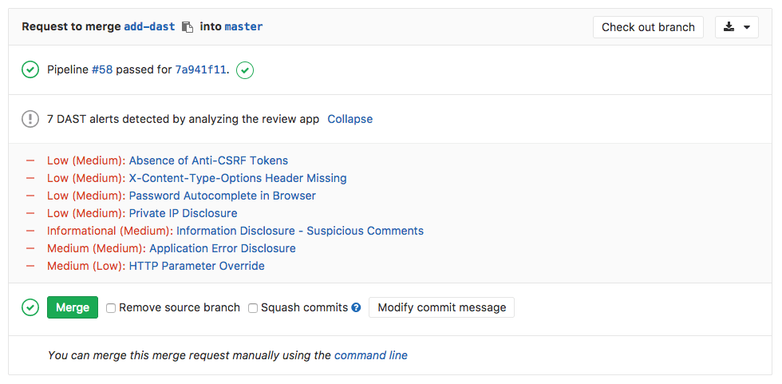
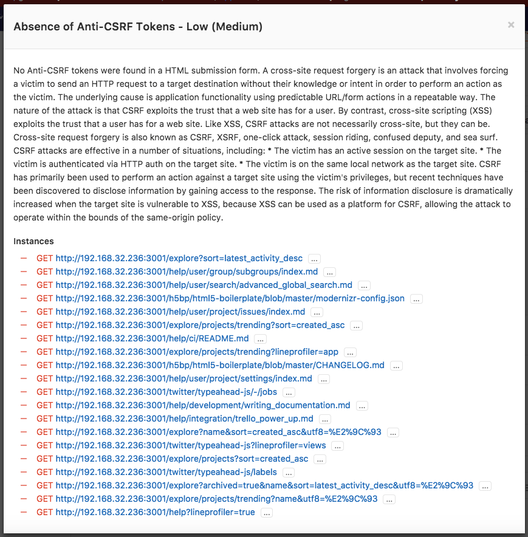

# Dynamic Application Security Testing (DAST) **(ULTIMATE)**

> [Introduced](https://gitlab.com/gitlab-org/gitlab-ee/issues/4348)
in [GitLab Ultimate](https://about.gitlab.com/pricing/) 10.4.

NOTE: **4 of the top 6 attacks were application based.**
Download our whitepaper,
["A Seismic Shift in Application Security"](https://about.gitlab.com/resources/whitepaper-seismic-shift-application-security/)
to learn how to protect your organization.

Running [static checks](../sast/index.md) on your code is the first step to detect
vulnerabilities that can put the security of your code at risk. Yet, once
deployed, your application is exposed to a new category of possible attacks,
such as cross-site scripting or broken authentication flaws. This is where
Dynamic Application Security Testing (DAST) comes into place.

## Overview

If you are using [GitLab CI/CD](../../../ci/README.md), you can analyze your running web application(s)
for known vulnerabilities using Dynamic Application Security Testing (DAST).

You can take advantage of DAST by either [including the CI job](#configuration) in
your existing `.gitlab-ci.yml` file or by implicitly using
[Auto DAST](../../../topics/autodevops/index.md#auto-dast-ultimate)
that is provided by [Auto DevOps](../../../topics/autodevops/index.md).

GitLab checks the DAST report, compares the found vulnerabilities between the source and target
branches, and shows the information right on the merge request.



By clicking on one of the detected linked vulnerabilities, you will be able to
see the details and the URL(s) affected.



[Dynamic Application Security Testing (DAST)](https://en.wikipedia.org/wiki/Dynamic_Application_Security_Testing)
is using the popular open source tool [OWASP ZAProxy](https://github.com/zaproxy/zaproxy)
to perform an analysis on your running web application.

By default, DAST executes [ZAP Baseline Scan](https://github.com/zaproxy/zaproxy/wiki/ZAP-Baseline-Scan) and will perform passive scanning only. It will not actively attack your application.

However, DAST can be [configured](#full-scan)
to also perform a so-called "active scan". That is, attack your application and produce a more extensive security report.
It can be very useful combined with [Review Apps](../../../ci/review_apps/index.md).

The [`dast`](https://gitlab.com/gitlab-org/security-products/dast/container_registry) Docker image in GitLab container registry is updated on a weekly basis to have all [`owasp2docker-weekly`](https://hub.docker.com/r/owasp/zap2docker-weekly/) updates in it.

## Use cases

It helps you automatically find security vulnerabilities in your running web
applications while you are developing and testing your applications.

## Requirements

To run a DAST job, you need GitLab Runner with the
[`docker` executor](https://docs.gitlab.com/runner/executors/docker.html).

## Configuration

For GitLab 11.9 and later, to enable DAST, you must
[include](../../../ci/yaml/README.md#includetemplate) the
[`DAST.gitlab-ci.yml` template](https://gitlab.com/gitlab-org/gitlab-ee/blob/master/lib/gitlab/ci/templates/Security/DAST.gitlab-ci.yml)
that's provided as a part of your GitLab installation.
For GitLab versions earlier than 11.9, you can copy and use the job as defined
in that template.

Add the following to your `.gitlab-ci.yml` file:

```yaml
include:
  template: DAST.gitlab-ci.yml

variables:
  DAST_WEBSITE: https://example.com
```

There are two ways to define the URL to be scanned by DAST:

- Set the `DAST_WEBSITE` [variable](../../../ci/yaml/README.md#variables).
- Add it in an `environment_url.txt` file at the root of your project.

If both values are set, the `DAST_WEBSITE` value will take precedence.

The included template will create a `dast` job in your CI/CD pipeline and scan
your project's source code for possible vulnerabilities.

The results will be saved as a
[DAST report artifact](../../../ci/yaml/README.md#artifactsreportsdast-ultimate)
that you can later download and analyze. Due to implementation limitations we
always take the latest DAST artifact available. Behind the scenes, the
[GitLab DAST Docker image](https://gitlab.com/gitlab-org/security-products/dast)
is used to run the tests on the specified URL and scan it for possible vulnerabilities.

### Authenticated scan

It's also possible to authenticate the user before performing the DAST checks:

```yaml
include:
  template: DAST.gitlab-ci.yml

variables:
  DAST_WEBSITE: https://example.com
  DAST_AUTH_URL: https://example.com/sign-in
  DAST_USERNAME: john.doe@example.com
  DAST_PASSWORD: john-doe-password
  DAST_USERNAME_FIELD: session[user] # the name of username field at the sign-in HTML form
  DAST_PASSWORD_FIELD: session[password] # the name of password field at the sign-in HTML form
  DAST_AUTH_EXCLUDE_URLS: http://example.com/sign-out,http://example.com/sign-out-2 # optional, URLs to skip during the authenticated scan; comma-separated, no spaces in between
```

The results will be saved as a
[DAST report artifact](../../../ci/yaml/README.md#artifactsreportsdast-ultimate)
that you can later download and analyze.
Due to implementation limitations, we always take the latest DAST artifact available.

### Full scan

DAST can be configured to perform [ZAP Full Scan](https://github.com/zaproxy/zaproxy/wiki/ZAP-Full-Scan), which
includes both passive and active scanning against the same target website:

```yaml
include:
  template: DAST.gitlab-ci.yml

variables:
  DAST_FULL_SCAN_ENABLED: "true"
```

#### Domain validation

Domain validation is not required by default. It can be required by setting the [environment variable](#available-variables) `DAST_FULL_SCAN_DOMAIN_VALIDATION_REQUIRED` to true.

Since ZAP full scan actively attacks the target application, DAST sends a ping to the target (normally defined in `DAST_WEBSITE` or `environment_url.txt`) beforehand.

If `DAST_FULL_SCAN_DOMAIN_VALIDATION_REQUIRED` is false or unset, the scan will _proceed_ unless the response to the ping
includes a `Gitlab-DAST-Permission` header with a value of `deny`.

If `DAST_FULL_SCAN_DOMAIN_VALIDATION_REQUIRED` is true, the scan will _exit_ unless the response to the ping
includes a `Gitlab-DAST-Permission` header with a value of `allow`.


Here are some examples of adding the `Gitlab-DAST-Permission` header to a response in Rails, Django, and Node (with Express).

##### Ruby on Rails

Here's how you would add a [custom header in Ruby on Rails](https://guides.rubyonrails.org/action_controller_overview.html#setting-custom-headers):

```ruby
class DastWebsiteTargetController < ActionController::Base
  def dast_website_target
    response.headers['Gitlab-DAST-Permission'] = 'allow'

    head :ok
  end
end
```

##### Django

Here's how you would add a [custom header in Django](https://docs.djangoproject.com/en/2.2/ref/request-response/#setting-header-fields):

```python
class DastWebsiteTargetView(View):
    def head(self, *args, **kwargs):
      response = HttpResponse()
      response['Gitlab-Dast-Permission'] = 'allow'

      return response
```

##### Node (with Express)

Here's how you would add a [custom header in Node (with Express)](http://expressjs.com/en/5x/api.html#res.append):

```javascript
app.get('/dast-website-target', function(req, res) {
  res.append('Gitlab-DAST-Permission', 'allow')
  res.send('Respond to DAST ping')
})
```

##### Domain validation header via a proxy

It's also possible to add the `Gitlab-DAST-Permission` header via a proxy.
DAST's test suite uses an nginx proxy in a Docker container to allow us to add the
header without modifying the tested application directly.

The proxy container is very simple:

```
docker run --rm --network test --name test-proxy -v <path_to_nginx_config>:/etc/nginx/conf.d/default.conf nginx:alpine
```

The NGINX config sets up the proxy to add the header:

```
server {
    listen 80;
    server_name localhost;

    location / {
        proxy_pass http://test-application;
        add_header Gitlab-DAST-Permission allow;
    }
}
```

Then, update `DAST_WEBSITE` or `environment_url.txt` to point to the proxy container.

In this example, running DAST manually looks like:

```
docker run -e DAST_FULL_SCAN_ENABLED -e DAST_FULL_SCAN_DOMAIN_VALIDATION_ENABLED --rm \
  --network test --volume "$PWD":/output \
  registry.gitlab.com/gitlab-org/security-products/dast:${VERSION:-latest} \
  /analyze -t http://test-proxy
```

### Customizing the DAST settings

The DAST settings can be changed through environment variables by using the
[`variables`](../../../ci/yaml/README.md#variables) parameter in `.gitlab-ci.yml`.
These variables are documented in [available variables](#available-variables).

For example:

```yaml
include:
  template: DAST.gitlab-ci.yml

variables:
  DAST_WEBSITE: https://example.com
  DAST_TARGET_AVAILABILITY_TIMEOUT: 120
```

Because the template is [evaluated before](../../../ci/yaml/README.md#include) the pipeline
configuration, the last mention of the variable will take precedence.

### Overriding the DAST template

If you want to override the job definition (for example, change properties like
`variables` or `dependencies`), you need to declare a `dast` job after the
template inclusion and specify any additional keys under it. For example:

```yaml
include:
  template: DAST.gitlab-ci.yml

dast:
  stage: dast # IMPORTANT: don't forget to add this
  variables:
    DAST_WEBSITE: https://example.com
    CI_DEBUG_TRACE: "true"
```

As the DAST job belongs to a separate `dast` stage that runs after all
[default stages](../../../ci/yaml/README.md#stages),
don't forget to add `stage: dast` when you override the template job definition.

## Available variables

DAST can be [configured](#customizing-the-dast-settings) using environment variables.
Since it's a wrapper around the ZAP scanning scripts
([baseline](https://github.com/zaproxy/zaproxy/wiki/ZAP-Baseline-Scan)
or [full](https://github.com/zaproxy/zaproxy/wiki/ZAP-Full-Scan) scan), it
accepts all arguments those scripts recognize (the arguments are the same).
The choice of the scan type depends on the `DAST_FULL_SCAN_ENABLED` environment
variable value.

| Environment variable        | Required   | Description                                                                    |
|-----------------------------| ----------|--------------------------------------------------------------------------------|
| `DAST_WEBSITE`  | yes | The URL of the website to scan. |
| `DAST_AUTH_URL` | no | The authentication URL of the website to scan. |
| `DAST_USERNAME` | no | The username to authenticate to in the website. |
| `DAST_PASSWORD` | no | The password to authenticate to in the website. |
| `DAST_USERNAME_FIELD` | no | The name of username field at the sign-in HTML form. |
| `DAST_PASSWORD_FIELD` | no | The name of password field at the sign-in HTML form. |
| `DAST_AUTH_EXCLUDE_URLS` | no | The URLs to skip during the authenticated scan; comma-separated, no spaces in between. |
| `DAST_TARGET_AVAILABILITY_TIMEOUT` | no | Time limit in seconds to wait for target availability. Scan is attempted nevertheless if it runs out. Integer. Defaults to `60`. |
| `DAST_FULL_SCAN_ENABLED` | no | Switches the tool to execute [ZAP Full Scan](https://github.com/zaproxy/zaproxy/wiki/ZAP-Full-Scan) instead of [ZAP Baseline Scan](https://github.com/zaproxy/zaproxy/wiki/ZAP-Baseline-Scan). Boolean. `true`, `True`, or `1` are considered as true value, otherwise false. Defaults to `false`. |
| `DAST_FULL_SCAN_DOMAIN_VALIDATION_REQUIRED` | no | Requires [domain validation](#domain-validation) when running DAST full scans. Boolean. `true`, `True`, or `1` are considered as true value, otherwise false. Defaults to `false`. |

## Security Dashboard

The Security Dashboard is a good place to get an overview of all the security
vulnerabilities in your groups, projects and pipelines. Read more about the
[Security Dashboard](../security_dashboard/index.md).

## Interacting with the vulnerabilities

Once a vulnerability is found, you can interact with it. Read more on how to
[interact with the vulnerabilities](../index.md#interacting-with-the-vulnerabilities).

## Vulnerabilities database update

For more information about the vulnerabilities database update, check the
[maintenance table](../index.md#maintenance-and-update-of-the-vulnerabilities-database).

<!-- ## Troubleshooting

Include any troubleshooting steps that you can foresee. If you know beforehand what issues
one might have when setting this up, or when something is changed, or on upgrading, it's
important to describe those, too. Think of things that may go wrong and include them here.
This is important to minimize requests for support, and to avoid doc comments with
questions that you know someone might ask.

Each scenario can be a third-level heading, e.g. `### Getting error message X`.
If you have none to add when creating a doc, leave this section in place
but commented out to help encourage others to add to it in the future. -->
