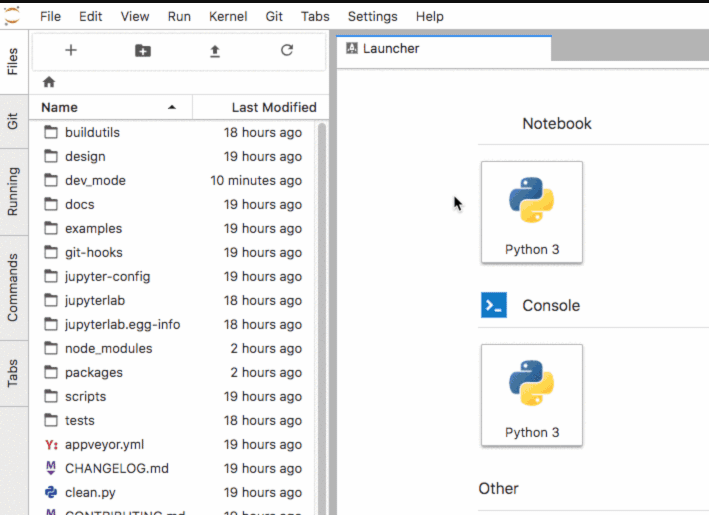
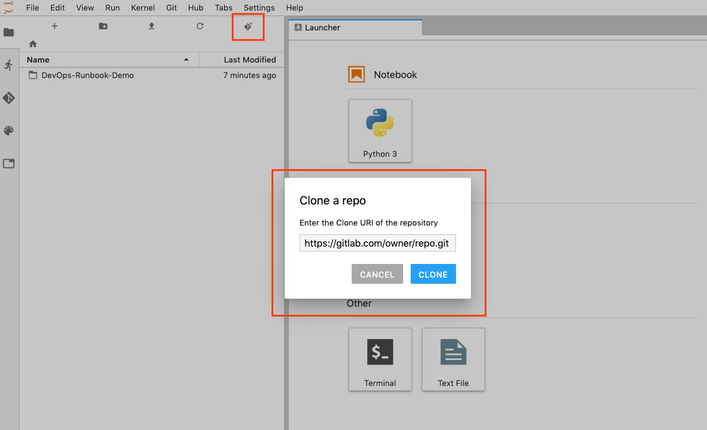

# GitLab Managed Apps

GitLab provides **GitLab Managed Apps**, a one-click install for various applications which can
be added directly to your configured cluster.

These applications are needed for [Review Apps](../../ci/review_apps/index.md)
and [deployments](../../ci/environments.md) when using [Auto DevOps](../../topics/autodevops/index.md).

You can install them after you
[create a cluster](../project/clusters/index.md#adding-and-removing-clusters).

## Installing applications

Applications managed by GitLab will be installed onto the `gitlab-managed-apps` namespace.

This namespace:

- Is different from the namespace used for project deployments.
- Is created once.
- Has a non-configurable name.

To see a list of available applications to install:

1. For a:
   - [Project-level cluster](../project/clusters/index.md),
     navigate to your project's **Operations > Kubernetes**.
   - [Group-level cluster](../group/clusters/index.md),
     navigate to your group's **Kubernetes** page.

Install Helm first as it's used to install other applications.

NOTE: **Note:**
As of GitLab 11.6, Helm will be upgraded to the latest version supported
by GitLab before installing any of the applications.

The following applications can be installed:

- [Helm](#helm)
- [Ingress](#ingress)
- [Cert-Manager](#cert-manager)
- [Prometheus](#prometheus)
- [GitLab Runner](#gitlab-runner)
- [JupyterHub](#jupyterhub)
- [Knative](#knative)

With the exception of Knative, the applications will be installed in a dedicated
namespace called `gitlab-managed-apps`.

NOTE: **Note:**
Some applications are installable only for a project-level cluster.
Support for installing these applications in a group-level cluster is
planned for future releases.
For updates, see [the issue tracking
progress](https://gitlab.com/gitlab-org/gitlab-ce/issues/51989).

CAUTION: **Caution:**
If you have an existing Kubernetes cluster with Helm already installed,
you should be careful as GitLab cannot detect it. In this case, installing
Helm via the applications will result in the cluster having it twice, which
can lead to confusion during deployments.

### Helm

> - Available for project-level clusters since GitLab 10.2.
> - Available for group-level clusters since GitLab 11.6.

[Helm](https://docs.helm.sh/) is a package manager for Kubernetes and is
required to install all the other applications. It is installed in its
own pod inside the cluster which can run the `helm` CLI in a safe
environment.

### Cert-Manager

> - Available for project-level clusters since GitLab 11.6.
> - Available for group-level clusters since GitLab 11.6.

[Cert-Manager](https://docs.cert-manager.io/en/latest/) is a native
Kubernetes certificate management controller that helps with issuing
certificates. Installing Cert-Manager on your cluster will issue a
certificate by [Let's Encrypt](https://letsencrypt.org/) and ensure that
certificates are valid and up-to-date.

NOTE: **Note:**
The
[jetstack/cert-manager](https://github.com/jetstack/cert-manager)
chart is used to install this application with a
[`values.yaml`](https://gitlab.com/gitlab-org/gitlab-ce/blob/master/vendor/cert_manager/values.yaml)
file. Prior to GitLab 12.3,
the [stable/cert-manager](https://github.com/helm/charts/tree/master/stable/cert-manager)
chart was used.

### GitLab Runner

> - Available for project-level clusters since GitLab 10.6.
> - Available for group-level clusters since GitLab 11.10.

[GitLab Runner](https://docs.gitlab.com/runner/) is the open source
project that is used to run your jobs and send the results back to
GitLab. It is used in conjunction with [GitLab
CI/CD](../../ci/README.md), the open-source continuous integration
service included with GitLab that coordinates the jobs. When installing
the GitLab Runner via the applications, it will run in **privileged
mode** by default. Make sure you read the [security
implications](../project/clusters/index.md#security-implications) before doing so.

NOTE: **Note:**
The
[runner/gitlab-runner](https://gitlab.com/gitlab-org/charts/gitlab-runner)
chart is used to install this application with a
[`values.yaml`](https://gitlab.com/gitlab-org/gitlab-ce/blob/master/vendor/runner/values.yaml)
file.

### Ingress

> - Available for project-level clusters since GitLab 10.2.
> - Available for group-level clusters since GitLab 11.6.

[Ingress](https://kubernetes.github.io/ingress-nginx/) can provide load
balancing, SSL termination, and name-based virtual hosting. It acts as a
web proxy for your applications and is useful if you want to use [Auto
DevOps](../../topics/autodevops/index.md) or deploy your own web apps.

NOTE: **Note:**
The
[stable/nginx-ingress](https://github.com/helm/charts/tree/master/stable/nginx-ingress)
chart is used to install this application with a
[`values.yaml`](https://gitlab.com/gitlab-org/gitlab-ce/blob/master/vendor/ingress/values.yaml)
file.

### JupyterHub

> Available for project-level clusters since GitLab 11.0.

[JupyterHub](https://jupyterhub.readthedocs.io/en/stable/) is a
multi-user service for managing notebooks across a team. [Jupyter
Notebooks](https://jupyter-notebook.readthedocs.io/en/latest/) provide a
web-based interactive programming environment used for data analysis,
visualization, and machine learning.

Authentication will be enabled only for [project
members](../project/members/index.md) with [Developer or
higher](../permissions.md) access to the project.

We use a [custom Jupyter
image](https://gitlab.com/gitlab-org/jupyterhub-user-image/blob/master/Dockerfile)
that installs additional useful packages on top of the base Jupyter. You
will also see ready-to-use DevOps Runbooks built with Nurtch's [Rubix library](https://github.com/amit1rrr/rubix).

More information on
creating executable runbooks can be found in [our Runbooks
documentation](../project/clusters/runbooks/index.md#executable-runbooks). Note that
Ingress must be installed and have an IP address assigned before
JupyterHub can be installed.

NOTE: **Note:**
The
[jupyter/jupyterhub](https://jupyterhub.github.io/helm-chart/)
chart is used to install this application with a
[`values.yaml`](https://gitlab.com/gitlab-org/gitlab-ce/blob/master/vendor/jupyter/values.yaml)
file.

#### Jupyter Git Integration

> [Introduced](https://gitlab.com/gitlab-org/gitlab-ce/merge_requests/28783) in GitLab 12 for project-level clusters.

When installing JupyterHub onto your Kubernetes cluster, [JupyterLab's Git extension](https://github.com/jupyterlab/jupyterlab-git)
is automatically provisioned and configured using the authenticated user's:

- Name.
- Email.
- Newly created access token.

JupyterLab's Git extension enables full version control of your notebooks as well as issuance of Git commands within Jupyter.
Git commands can be issued via the **Git** tab on the left panel or via Jupyter's command line prompt.

NOTE: **Note:**
JupyterLab's Git extension stores the user token in the JupyterHub DB in encrypted format
and in the single user Jupyter instance as plain text. This is because [Git requires storing
credentials as plain text](https://git-scm.com/docs/git-credential-store). Potentially, if
a nefarious user finds a way to read from the file system in the single user Jupyter instance
they could retrieve the token.



You can clone repositories from the files tab in Jupyter:



### Knative

> Available for project-level clusters since GitLab 11.5.

[Knative](https://cloud.google.com/knative) provides a platform to
create, deploy, and manage serverless workloads from a Kubernetes
cluster. It is used in conjunction with, and includes
[Istio](https://istio.io) to provide an external IP address for all
programs hosted by Knative.

You will be prompted to enter a wildcard
domain where your applications will be exposed. Configure your DNS
server to use the external IP address for that domain. For any
application created and installed, they will be accessible as
`<program_name>.<kubernetes_namespace>.<domain_name>`. This will require
your kubernetes cluster to have [RBAC
enabled](../project/clusters/index.md#rbac-cluster-resources).

NOTE: **Note:**
The
[knative/knative](https://storage.googleapis.com/triggermesh-charts)
chart is used to install this application.

### Prometheus

> - Available for project-level clusters since GitLab 10.4.
> - Available for group-level clusters since GitLab 11.11.

[Prometheus](https://prometheus.io/docs/introduction/overview/) is an
open-source monitoring and alerting system useful to supervise your
deployed applications.

NOTE: **Note:**
The
[stable/prometheus](https://github.com/helm/charts/tree/master/stable/prometheus)
chart is used to install this application with a
[`values.yaml`](https://gitlab.com/gitlab-org/gitlab-ce/blob/master/vendor/prometheus/values.yaml)
file.

## Upgrading applications

> [Introduced](https://gitlab.com/gitlab-org/gitlab-ce/merge_requests/24789) in GitLab 11.8.

The applications below can be upgraded.

| Application | GitLab version |
| ----------- | -------------- |
| Runner  | 11.8+          |

To upgrade an application:

1. For a:
   - [Project-level cluster](../project/clusters/index.md),
     navigate to your project's **Operations > Kubernetes**.
   - [Group-level cluster](../group/clusters/index.md),
     navigate to your group's **Kubernetes** page.
1. Select your cluster.
1. If an upgrade is available, the **Upgrade** button is displayed. Click the button to upgrade.

NOTE: **Note:**
Upgrades will reset values back to the values built into the `runner`
chart plus the values set by
[`values.yaml`](https://gitlab.com/gitlab-org/gitlab-ce/blob/master/vendor/runner/values.yaml)

## Uninstalling applications

> [Introduced](https://gitlab.com/gitlab-org/gitlab-ce/issues/60665) in
> GitLab 11.11.

The applications below can be uninstalled.

| Application | GitLab version | Notes |
| ----------- | -------------- | ----- |
| Cert-Manager | 12.2+         | The associated private key will be deleted and cannot be restored. Deployed applications will continue to use HTTPS, but certificates will not be renewed. Before uninstalling, you may wish to [back up your configuration](https://docs.cert-manager.io/en/latest/tasks/backup-restore-crds.html) or [revoke your certificates](https://letsencrypt.org/docs/revoking/) |
| GitLab Runner  | 12.2+         | Any running pipelines will be canceled. |
| Helm  | 12.2+         | The associated Tiller pod will be deleted and cannot be restored. |
| Ingress  | 12.1+         | The associated load balancer and IP will be deleted and cannot be restored. Furthermore, it can only be uninstalled if JupyterHub is not installed. |
| JupyterHub  | 12.1+         | All data not committed to GitLab will be deleted and cannot be restored. |
| Knative  | 12.1+         | The associated IP will be deleted and cannot be restored. |
| Prometheus  | 11.11+         | All data will be deleted and cannot be restored. |

To uninstall an application:

1. For a:
   - [Project-level cluster](../project/clusters/index.md),
     navigate to your project's **Operations > Kubernetes**.
   - [Group-level cluster](../group/clusters/index.md),
     navigate to your group's **Kubernetes** page.
1. Select your cluster.
1. Click the **Uninstall** button for the application.

Support for uninstalling all applications is planned for progressive rollout.
To follow progress, see [the relevant
epic](https://gitlab.com/groups/gitlab-org/-/epics/1201).

## Troubleshooting applications

Applications can fail with the following error:

```text
Error: remote error: tls: bad certificate
```

To avoid installation errors:

- Before starting the installation of applications, make sure that time is synchronized
  between your GitLab server and your Kubernetes cluster.
- Ensure certificates are not out of sync. When installing applications, GitLab expects a new cluster with no previous installation of Helm.

  You can confirm that the certificates match via `kubectl`:

  ```sh
  kubectl get configmaps/values-content-configuration-ingress -n gitlab-managed-apps -o \
  "jsonpath={.data['cert\.pem']}" | base64 -d > a.pem
  kubectl get secrets/tiller-secret -n gitlab-managed-apps -o "jsonpath={.data['ca\.crt']}" | base64 -d > b.pem
  diff a.pem b.pem
  ```
