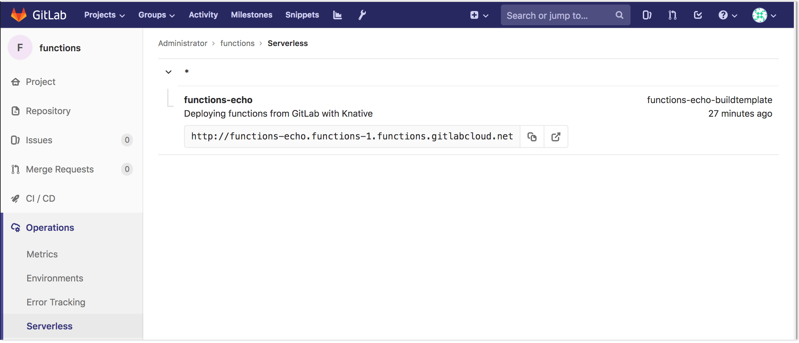
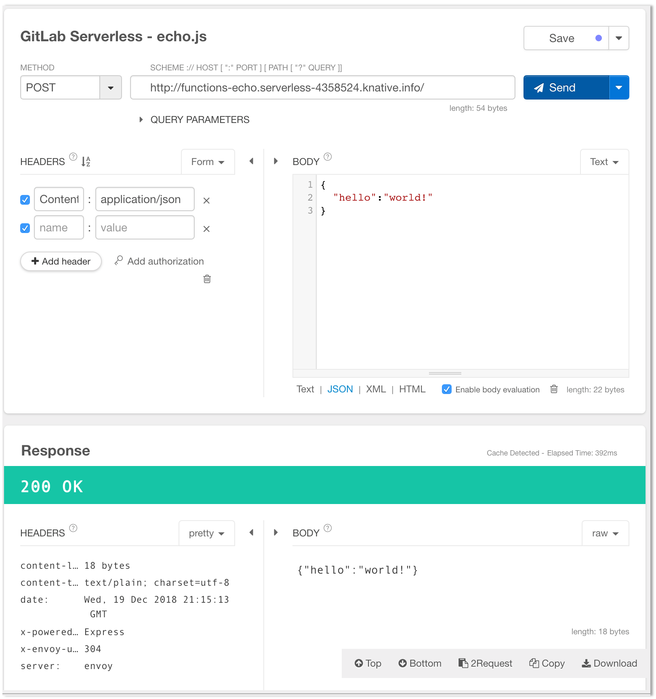
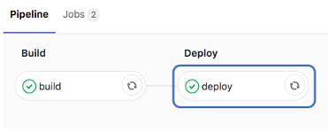

# Serverless

> Introduced in GitLab 11.5.

CAUTION: **Caution:**
Serverless is currently in [alpha](https://about.gitlab.com/handbook/product/#alpha).

Run serverless workloads on Kubernetes using [Knative](https://cloud.google.com/knative/).

## Overview

Knative extends Kubernetes to provide a set of middleware components that are useful to build modern, source-centric, container-based applications. Knative brings some significant benefits out of the box through its main components:

- [Build](https://github.com/knative/build): Source-to-container build orchestration.
- [Eventing](https://github.com/knative/eventing): Management and delivery of events.
- [Serving](https://github.com/knative/serving): Request-driven compute that can scale to zero.

For more information on Knative, visit the [Knative docs repo](https://github.com/knative/docs).

With GitLab serverless, you can deploy both functions-as-a-service (FaaS) and serverless applications.

## Prerequisites

To run Knative on Gitlab, you will need:

1. **Existing GitLab project:** You will need a GitLab project to associate all resources. The simplest way to get started:

    - If you are planning on deploying functions, clone the [functions example project](https://gitlab.com/knative-examples/functions) to get started.
    - If you are planning on deploying a serverless application, clone the sample [Knative Ruby App](https://gitlab.com/knative-examples/knative-ruby-app) to get started.

1. **Kubernetes Cluster:** An RBAC-enabled Kubernetes cluster is required to deploy Knative.
    The simplest way to get started is to add a cluster using [GitLab's GKE integration](../index.md#adding-and-creating-a-new-gke-cluster-via-gitlab).
    The set of minimum recommended cluster specifications to run Knative is 3 nodes, 6 vCPUs, and 22.50 GB memory.
1. **Helm Tiller:** Helm is a package manager for Kubernetes and is required to install
    Knative.
1. **GitLab Runner:** A runner is required to run the CI jobs that will deploy serverless
    applications or functions onto your cluster. You can install the GitLab Runner
    onto the existing Kubernetes cluster. See [Installing Applications](../index.md#installing-applications) for more information.
1. **Domain Name:** Knative will provide its own load balancer using Istio. It will provide an
    external IP address or hostname for all the applications served by Knative. You will be prompted to enter a
    wildcard domain where your applications will be served. Configure your DNS server to use the
    external IP address or hostname for that domain.
1. **`.gitlab-ci.yml`:** GitLab uses [Kaniko](https://github.com/GoogleContainerTools/kaniko)
    to build the application and the [TriggerMesh CLI](https://github.com/triggermesh/tm) to simplify the
    deployment of knative services and functions.
1. **`serverless.yml`** (for [functions only](#deploying-functions)): When using serverless to deploy functions, the `serverless.yml` file
    will contain the information for all the functions being hosted in the repository as well as a reference to the
    runtime being used.
1. **`Dockerfile`** (for [applications only](#deploying-serverless-applications): Knative requires a `Dockerfile` in order to build your application. It should be included
    at the root of your project's repo and expose port `8080`.
1. **Prometheus** (optional): Installing Prometheus allows you to monitor the scale and traffic of your serverless function/application.
    See [Installing Applications](../index.md#installing-applications) for more information.

## Installing Knative via GitLab's Kubernetes integration

NOTE: **Note:**
The minimum recommended cluster size to run Knative is 3-nodes, 6 vCPUs, and 22.50 GB memory. **RBAC must be enabled.**

1. [Add a Kubernetes cluster](../index.md) and [install Helm](../index.md#installing-applications).
1. Once Helm has been successfully installed, scroll down to the Knative app section. Enter the domain to be used with
    your application/functions (e.g. `example.com`) and click **Install**.

    

1. After the Knative installation has finished, you can wait for the IP address or hostname to be displayed in the
   **Knative Endpoint** field or [retrieve the Istio Ingress Endpoint manually](../#manually-determining-the-external-endpoint).

   NOTE: **Note:**
   Running `kubectl` commands on your cluster requires setting up access to the cluster first.
   For clusters created on GKE, see [GKE Cluster Access](https://cloud.google.com/kubernetes-engine/docs/how-to/cluster-access-for-kubectl),
   for other platforms [Install kubectl](https://kubernetes.io/docs/tasks/tools/install-kubectl/).

1. The ingress is now available at this address and will route incoming requests to the proper service based on the DNS
   name in the request. To support this, a wildcard DNS A record should be created for the desired domain name. For example,
   if your Knative base domain is `knative.info` then you need to create an A record or CNAME record with domain `*.knative.info`
   pointing the ip address or hostname of the ingress.

    

NOTE: **Note:**
You can deploy either [functions](#deploying-functions) or [serverless applications](#deploying-serverless-applications)
on a given project but not both. The current implementation makes use of a `serverless.yml` file to signal a FaaS project.

## Deploying functions

> Introduced in GitLab 11.6.

Using functions is useful for dealing with independent
events without needing to maintain a complex unified infrastructure. This allows
you to focus on a single task that can be executed/scaled automatically and independently.

Currently the following [runtimes](https://gitlab.com/triggermesh/runtimes) are offered:

- node.js
- kaniko

You can find and import all the files referenced in this doc in the **[functions example project](https://gitlab.com/knative-examples/functions)**.

Follow these steps to deploy a function using the Node.js runtime to your Knative instance (you can skip these steps if you've cloned the example project):

1. Create a directory that will house the function. In this example we will create a directory called `echo` at the root of the project.

1. Create the file that will contain the function code. In this example, our file is called `echo.js` and is located inside the `echo` directory. If your project is:
    - Public, continue to the next step.
    - Private, you will need to [create a GitLab deploy token](../../deploy_tokens/index.md#creating-a-deploy-token) with `gitlab-deploy-token` as the name and the `read_registry` scope.

1. `.gitlab-ci.yml`: This template allows to define the stage, environment, and
   image to be used for your functions. It must be included at the root of your repository:

   ```yaml
   stages:
     - deploy

   functions:
     stage: deploy
     environment: test
     image: gcr.io/triggermesh/tm:v0.0.9
     script:
      - tm -n "$KUBE_NAMESPACE" set registry-auth gitlab-registry --registry "$CI_REGISTRY" --username "$CI_REGISTRY_USER" --password "$CI_JOB_TOKEN" --push
      - tm -n "$KUBE_NAMESPACE" set registry-auth gitlab-registry --registry "$CI_REGISTRY" --username "$CI_DEPLOY_USER" --password "$CI_DEPLOY_PASSWORD" --pull
      - tm -n "$KUBE_NAMESPACE" deploy --wait

   ```

    The `gitlab-ci.yml` template creates a `Deploy` stage with a `functions` job that invokes the `tm` CLI with the required parameters.

2. `serverless.yml`: This file contains the metadata for your functions,
   such as name, runtime, and environment. It must be included at the root of your repository. The following is a sample `echo` function which shows the required structure for the file. You can find the relevant files for this project in the [functions example project](https://gitlab.com/knative-examples/functions).

   ```yaml
   service: my-functions
   description: "Deploying functions from GitLab using Knative"

   provider:
     name: triggermesh
     registry-secret: gitlab-registry
     environment:
       FOO: BAR

   functions:
     echo:
       handler: echo
       runtime: https://gitlab.com/triggermesh/runtimes/raw/master/nodejs.yaml
       description: "echo function using node.js runtime"
       buildargs:
        - DIRECTORY=echo
       environment:
        FUNCTION: echo
   ```

The `serverless.yml` file references both an `echo` directory (under `buildargs`) and an `echo` file (under `handler`),
which is a reference to `echo.js` in the [repository](https://gitlab.com/knative-examples/functions). Additionally, it
contains three sections with distinct parameters:

### `service`

| Parameter | Description |
|-----------|-------------|
| `service` | Name for the Knative service which will serve the function. |
| `description` | A short description of the `service`. |

### `provider`

| Parameter | Description |
|-----------|-------------|
| `name` | Indicates which provider is used to execute the `serverless.yml` file. In this case, the TriggerMesh `tm` CLI. |
| `registry-secret` | Indicates which registry will be used to store docker images. The sample function is using the GitLab Registry (`gitlab-registry`). A different registry host may be specified using `registry` key in the `provider` object. If changing the default, update the permission and the secret value on the `gitlab-ci.yml` file |
| `environment` | Includes the environment variables to be passed as part of function execution for **all** functions in the file, where `FOO` is the variable name and `BAR` are he variable contents. You may replace this with you own variables. |

### `functions`

In the `serverless.yml` example above, the function name is `echo` and the subsequent lines contain the function attributes.

| Parameter | Description |
|-----------|-------------|
| `handler` | The function's file name. In the example above, both the function name and the handler are the same. |
| `runtime` | The runtime to be used to execute the function. |
| `description` | A short description of the function. |
| `buildargs` | Pointer to the function file in the repo. In the sample the function is located in the `echo` directory. |
| `environment` | Sets an environment variable for the specific function only. |

After the `gitlab-ci.yml` template has been added and the `serverless.yml` file has been
created, pushing a commit to your project will result in a
CI pipeline being executed which will deploy each function as a Knative service.
Once the deploy stage has finished, additional details for the function will
appear under **Operations > Serverless**.



This page contains all functions available for the project, the description for
accessing the function, and, if available, the function's runtime information.
The details are derived from the Knative installation inside each of the project's
Kubernetes cluster. Click on each function to obtain detailed scale and invocation data.

The function details can be retrieved directly from Knative on the cluster:

```bash
kubectl -n "$KUBE_NAMESPACE" get services.serving.knative.dev
```

The sample function can now be triggered from any HTTP client using a simple `POST` call:

  1. Using curl (replace the URL on the last line with the URL of your application):

      ```bash
      curl \
      --header "Content-Type: application/json" \
      --request POST \
      --data '{"GitLab":"FaaS"}' \
      <http://functions-echo.functions-1.functions.example.com/>
      ```
  2. Using a web-based tool (ie. postman, restlet, etc)

      

## Deploying Serverless applications

> Introduced in GitLab 11.5.

NOTE: **Note:**
You can reference and import the sample [Knative Ruby App](https://gitlab.com/knative-examples/knative-ruby-app) to get started.

Add the following `.gitlab-ci.yml` to the root of your repository
(you may skip this step if you've previously cloned the sample [Knative Ruby App](https://gitlab.com/knative-examples/knative-ruby-app) mentioned above):

```yaml
stages:
  - build
  - deploy

build:
  stage: build
  image:
    name: gcr.io/kaniko-project/executor:debug
    entrypoint: [""]
  only:
    - master
  script:
    - echo "{\"auths\":{\"$CI_REGISTRY\":{\"username\":\"$CI_REGISTRY_USER\",\"password\":\"$CI_REGISTRY_PASSWORD\"}}}" > /kaniko/.docker/config.json
    - /kaniko/executor --context $CI_PROJECT_DIR --dockerfile $CI_PROJECT_DIR/Dockerfile --destination $CI_REGISTRY_IMAGE

deploy:
  stage: deploy
  image: gcr.io/triggermesh/tm@sha256:e3ee74db94d215bd297738d93577481f3e4db38013326c90d57f873df7ab41d5
  only:
    - master
  environment: production
  script:
    - echo "$CI_REGISTRY_IMAGE"
    - tm -n "$KUBE_NAMESPACE" --config "$KUBECONFIG" deploy service "$CI_PROJECT_NAME" --from-image "$CI_REGISTRY_IMAGE" --wait
```

### Deploy the application with Knative

With all the pieces in place, the next time a CI pipeline runs, the Knative application will be deployed. Navigate to
**CI/CD > Pipelines** and click the most recent pipeline.

### Obtain the URL for the Knative deployment

Go to the **CI/CD > Pipelines** and click on the pipeline that deployed your app. Once all the stages of the pipeline finish, click the **deploy** stage.



The output will look like this:

```bash
Running with gitlab-runner 11.5.0~beta.844.g96d88322 (96d88322)
  on docker-auto-scale 72989761
Using Docker executor with image gcr.io/triggermesh/tm@sha256:e3ee74db94d215bd297738d93577481f3e4db38013326c90d57f873df7ab41d5 ...
Pulling docker image gcr.io/triggermesh/tm@sha256:e3ee74db94d215bd297738d93577481f3e4db38013326c90d57f873df7ab41d5 ...
Using docker image sha256:6b3f6590a9b30bd7aafb9573f047d930c70066e43955b4beb18a1eee175f6de1 for gcr.io/triggermesh/tm@sha256:e3ee74db94d215bd297738d93577481f3e4db38013326c90d57f873df7ab41d5 ...
Running on runner-72989761-project-4342902-concurrent-0 via runner-72989761-stg-srm-1541795796-27929c96...
Cloning repository...
Cloning into '/builds/danielgruesso/knative'...
Checking out 8671ad20 as master...
Skipping Git submodules setup
$ echo "$CI_REGISTRY_IMAGE"
registry.staging.gitlab.com/danielgruesso/knative
$ tm -n "$KUBE_NAMESPACE" --config "$KUBECONFIG" deploy service "$CI_PROJECT_NAME" --from-image "$CI_REGISTRY_IMAGE" --wait
Deployment started. Run "tm -n knative-4342902 describe service knative" to see the details
Waiting for ready state.......
Service domain: knative.knative-4342902.example.com
Job succeeded
```

The second to last line, labeled **Service domain** contains the URL for the deployment. Copy and paste the domain into your
browser to see the app live.


